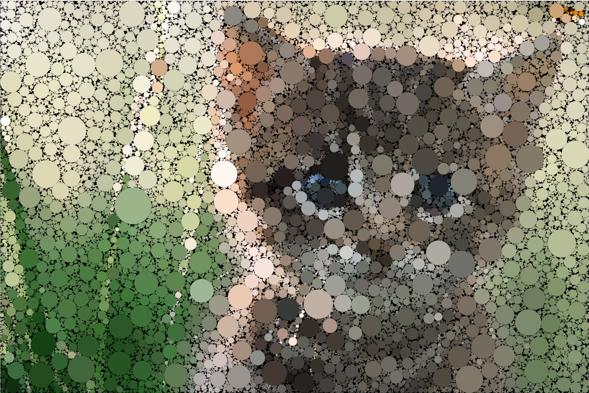

Animated [circle packing](http://mathworld.wolfram.com/CirclePacking.html) in Processing using a background image to seed the colors. Based on [this tutorial](https://www.youtube.com/watch?v=ERQcYaaZ6F0) from Coding Train. Background image is of a kitten and is located in data/background.jpg.

Result:

